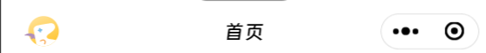

# CustomNavBar 自定义标题栏

## 效果展示



## 代码演示

```tsx
<CustomNavBar
  isBack
  bgColor="#FFFFFF"
  backHandler={handleClickEStaionIcon}
  backIcon={
    <Image
      src={iconEStation}
      style={{
        width: "64rpx",
        height: "64rpx",
      }}
    ></Image>
  }
>
  <View className="index-title">首页</View>
</CustomNavBar>
```

## Props

| 参数        | 类型              | 默认值           | 说明                 |
| ----------- | ----------------- | ---------------- | -------------------- |
| bgColor     | `string`          |                  | 背景颜色             |
| isBack      | `boolean`         | false            | 是否显示返回按钮区域 |
| backHandler | `() => void`      | 返回上一页的函数 | 返回按钮的点击回调   |
| fixed       | `boolean`         | false            | 是否固定             |
| backIcon    | `React.ReactNode` |                  | 返回处的内容         |
| children    | `React.ReactNode` |                  | 内部元素             |
| titleLeft   | `boolean`         |                  | 标题是否靠左         |
