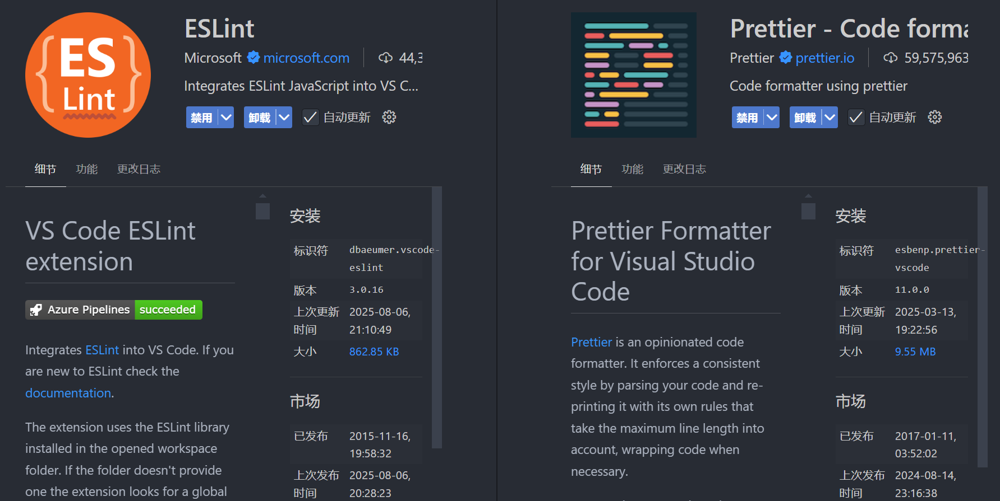

# 快速开始

## 项目安装

首先, 请确认你已经拥有了该项目的使用权限. 随后执行如下命令即可在本地部署项目:

```shell
# clone 项目到本地
git clone https://github.com/Milchstrassse/wx-ezhan.git wx-ezhan

# 进入下载目录
cd wx-ezhan

# 安装依赖并运行
yarn
yarn dev
```

随后选择代码目录, 使用微信开发者工具打开即可查看效果.

## 编辑器推荐

不管什么编辑器, 请确保安装了 `eslint` 以及 `prettier` 插件.



本人推荐使用 WebStorm, 免费, 而且真的非常好用, 几乎不需要任何的配置.

对于 VS Code, 请安装需要的插件.

## 代码规范

本项目已经配置了 `prettier` 以及 `eslint`. 请保证您的代码遵循代码规范, 否则 eslint 会报错. 下面是当前的代码规范:

### 括号与空格

1. 箭头函数参数必须使用括号
2. 对象字面量的括号前后保留空格
3. 标签闭合括号不与内容同行

### 引号与分号

1. 使用双引号
2. 语句结尾必须加分号
3. 对象属性仅在必要时加引号

### 缩进与换行

1. 缩进使用 2 个空格
2. 每行最大字符数为 80
3. 尾随逗号保留所有可能的情况
4. 单行不强制只写一个属性

### 变量声明

1. 禁止使用 var 声明变量
2. 允许使用 let 声明可重新赋值的变量

### 全局变量与类型

1. 关闭未定义变量检查
2. 允许使用 any 类型
3. 允许使用 require 导入模块
