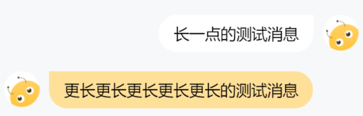

# ChatBubble 聊天信息对象

## 效果展示



## 代码演示

> 该组件不建议单独使用

```tsx
const ChatContainer: FC<IProps> = ({ layoutHeight, messageList }) => {
  return (
    <ScrollView
      scrollY
      style={{
        height: layoutHeight,
      }}
    >
      <View className="chat-container">
        {messageList.map((item) => (
          <ChatBubble
            key={item.content}
            isLeft={item.isLeft}
            content={item.content}
            avatar={item.avatar}
            type={item.type}
          ></ChatBubble>
        ))}
      </View>
    </ScrollView>
  );
};
```

## Props

|         参数         |        类型        | 默认值  |                 说明                 |
| :------------------: | :----------------: | :-----: | :----------------------------------: |
|        isLeft        |     `boolean`      |         |            该消息是否靠左            |
| rightBackgroundColor |      `string`      | #FFFFFF |          靠右聊天的背景颜色          |
| leftBackgroundColor  |      `string`      | #FFE099 |          靠左聊天的背景颜色          |
|       content        |      `string`      |         |          当前聊天气泡的内容          |
|        avatar        |      `string`      |         |          当前消息的用户头像          |
|         type         | `text` or `system` |  text   | 当前消息类别, 用户消息 或者 系统消息 |
