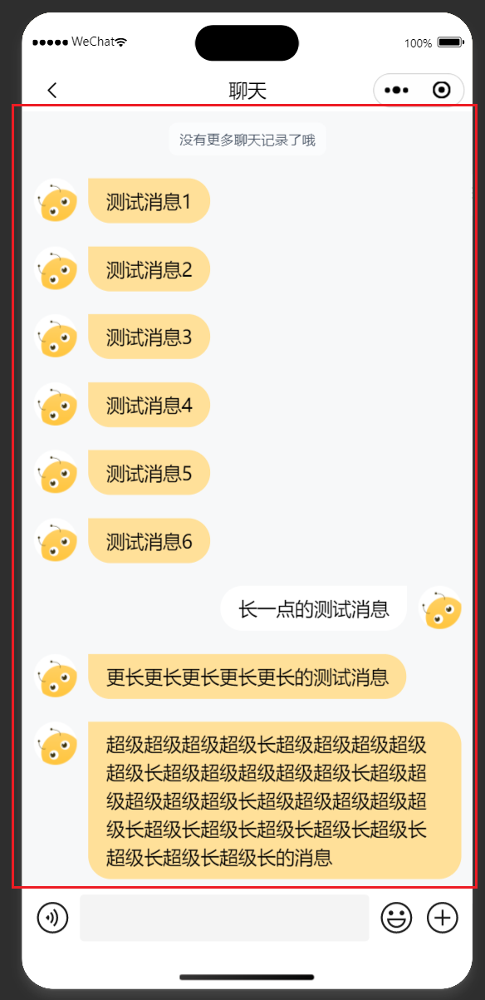

# ChatContainer 聊天信息容器

## 效果展示



## 代码演示

```tsx
const Index = () => {
  return (
    <ChatContainer
      layoutHeight={`calc(100vh - ${chatContainerHeight}px)`}
      messageList={__TEMP_CONTENTS}
    />
  );
};
```

## Props

|     参数     |     类型     | 默认值 |          说明          |
| :----------: | :----------: | :----: | :--------------------: |
| layoutHeight |   `string`   |        | 布局高度, 需要携带单位 |
| messageList  | `IMessage[]` |        |        消息列表        |
