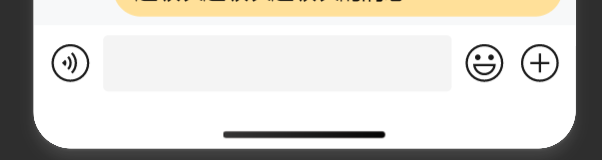

# ChatInputBox 聊天消息输入框

## 效果展示



## 代码演示

```tsx
const Index = () => {
  return (
    <View>
      <ChatInputBox handleSendMessage={handleSendMessage}></ChatInputBox>
    </View>
  );
};
```

## Props

|       参数        |            类型             | 默认值 |                  说明                  |
| :---------------: | :-------------------------: | :----: | :------------------------------------: |
| handleSendMessage | `(message: string) => void` |        | 发送消息的回调函数, 传入当前输入框消息 |
