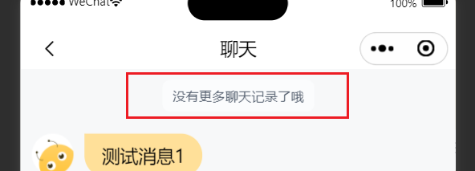

# ChatSystemMessage 系统信息对象

## 效果展示



## 代码演示

> 该组件不建议单独使用

```tsx
const Index = () => {
  if (type === "system") {
    return (
      <View className="chat-bubble-container-system">
        <ChatSystemMessage content={content} />
      </View>
    );
  }
  return null;
};
```

## Props

|  参数   |   类型   | 默认值 |     说明     |
| :-----: | :------: | :----: | :----------: |
| content | `string` |        | 系统消息文案 |
