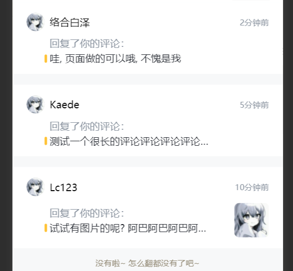

# MessageCardComment 收到的评论卡片

## 效果展示



## 代码演示

```tsx
const Index = () => {
  return __PINGLUN_DATA.map((item, index) => (
    <MessageCardComment
      key={`card-comment-${index}`}
      nickName={item.nickName}
      avatar={item.avatar}
      time={item.time}
      comment={item.comment}
      image={item.image}
    ></MessageCardComment>
  ));
};
```

## Props

|    参数    |     类型     | 默认值 |         说明         |
| :--------: | :----------: | :----: | :------------------: |
|  nickName  |   `string`   |        |        用户名        |
|   avatar   |   `string`   |        |       用户头像       |
|    time    |   `string`   |        |         时间         |
|  comment   |   `string`   |        |       评论内容       |
| onClick \* | `() => void` |        |     卡片点击事件     |
|  image \*  |   `string`   |        |       图片链接       |
|   key \*   |   `string`   |        | react 要求的组件 key |
