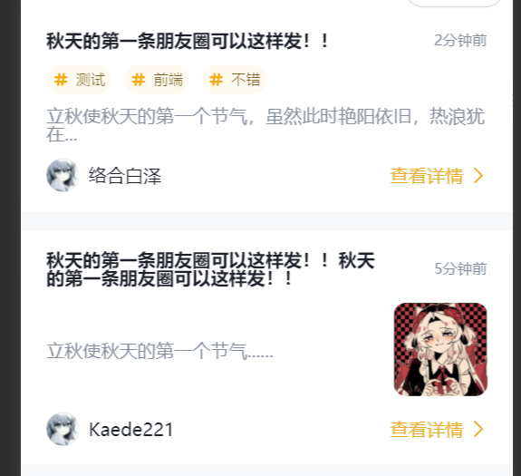

# MessageCardOfficial 官方资讯消息卡片

## 效果展示



## 代码演示

```tsx
const Index = () => {
  return __ZIXUN_DATA.map((item, index) => (
    <MessageCardOfficial
      key={item.key || `receive-content-${index}`}
      avatar={item.avatar}
      context={item.context}
      nickName={item.nickName}
      time={item.time}
      title={item.title}
      image={item.image}
      tagList={item.tagList}
    />
  ));
};
```

## Props

|    参数    |     类型     | 默认值 |         说明         |
| :--------: | :----------: | :----: | :------------------: |
|   title    |   `string`   |        |       资讯标题       |
|    time    |   `string`   |        |       资讯时间       |
|  context   |   `string`   |        |       资讯内容       |
|   avatar   |   `string`   |        |       头像链接       |
|  image \*  |   `string`   |        |       资讯图片       |
|  nickName  |   `string`   |        |        用户名        |
|  tagList   |   `string`   |        |       标签列表       |
|   key \*   |   `string`   |        | React 对象需要的 Key |
| onClick \* | `() => void` |        |    整体的点击事件    |
