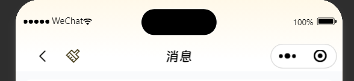

# MessageNavBar 聊天页面的顶栏

## 效果展示



## 代码演示

```tsx
const Index = () => {
  return <MessageNavBar headerTitle="消息" showClearIcon />;
};
```

## Props

|          参数           |     类型     | 默认值 |          说明          |
| :---------------------: | :----------: | :----: | :--------------------: |
|       headerTitle       |   `string`   |        |        标题内容        |
|    showClearIcon \*     |  `boolean`   |        |    是否显示清除按钮    |
| handleClickClearIcon \* | `() => void` |        | 点击清除按钮的回调函数 |
