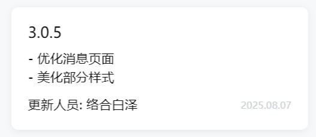

# DevLogCard 开发日志卡片

## 效果展示



## 代码演示

```tsx
const Index = () => {
  return (
    <View className="devLog-content">
      {DEVLOG.map((item) => (
        <DevLogCard logItem={item} key={item.date}></DevLogCard>
      ))}
    </View>
  );
};
```

## Props

|  参数   |   类型    | 默认值 |     说明     |
| :-----: | :-------: | :----: | :----------: |
| logItem | `IDevLog` |        | 开发日志对象 |
