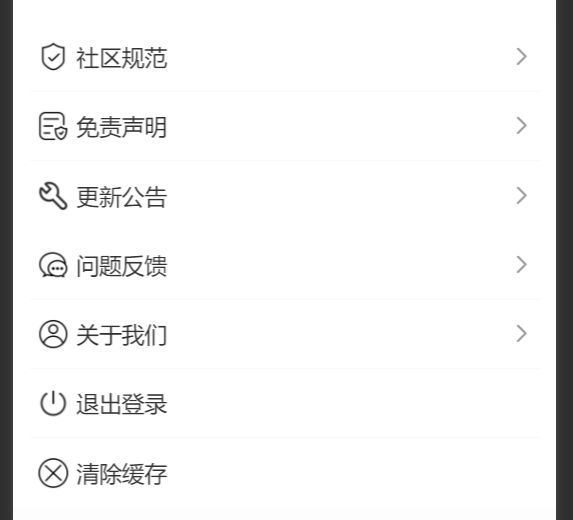

# MyMenuList 我的页面的菜单列表

## 效果展示



## 代码演示

```tsx
const Index = () => {
  return <MyMenuList isLogin={userStore.isLogin}></MyMenuList>;
};
```

## Props

|  参数   |   类型    | 默认值 |       说明       |
| :-----: | :-------: | :----: | :--------------: |
| isLogin | `boolean` |        | 当前是否已经登录 |
