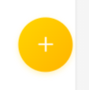

# FloatButton 悬浮按钮

## 效果展示



## 代码演示

```tsx
const Index = () => {
  return (
    <FloatButton
      onClick={() =>
        Taro.navigateTo({ url: routes.subPages.forum.publishPage })
      }
      icon={<Plus color="#FFFFFF" />}
      visible
    />
  );
};
```

## Props

|  参数   |       类型        | 默认值 |   说明   |
| :-----: | :---------------: | :----: | :------: |
| onClick |   `() => void`    |        | 点击事件 |
|  icon   | `React.ReactNode` |        |   图标   |
| visible |     `boolean`     |        | 是否显示 |
