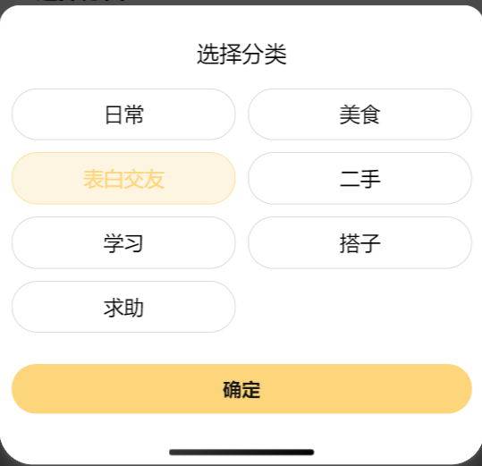

# PopupPicker 弹出选择器

## 效果展示



## 代码演示

```tsx
const Index = () => {
  const [showPicker, setShowPicker] = useState(false);
  const [themes, setThemes] = useState<string[]>([]);
  const [selectedTheme, setSelectedTheme] = useState("日常");

  return (
    <PopupPicker
      open={showPicker}
      categories={themes}
      onConfirm={(selected: string) => {
        setShowPicker(false);
        setSelectedTheme(selected);
      }}
      onClose={() => {
        setShowPicker(false);
      }}
    ></PopupPicker>
  );
};
```

## Props

|      参数       |                类型                |  默认值  |                    说明                    |
| :-------------: | :--------------------------------: | :------: | :----------------------------------------: |
|      title      |              `string`              | 选择分类 |                弹出层的标题                |
|     columns     |              `number`              |    2     |                 显示的列数                 |
|      open       |             `boolean`              |          |               弹出层是否显示               |
|   categories    |             `string[]`             |          |              分类字符串的列表              |
|    onConfirm    | `(selestringcted: string) => void` |          | 确认后的回调函数, 默认传入选择的内容字符串 |
|     onClose     |            `() => void`            |          |               关闭的回调函数               |
| defaultCategory |              `string`              |          |                默认的分类项                |
